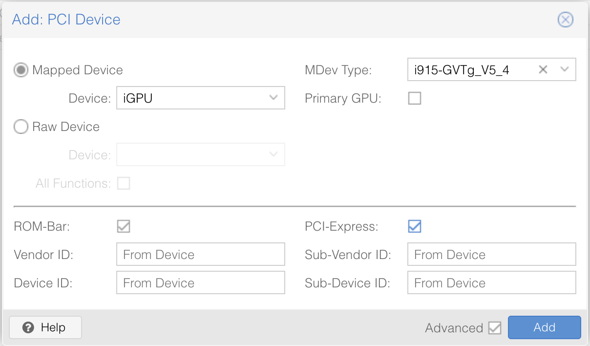
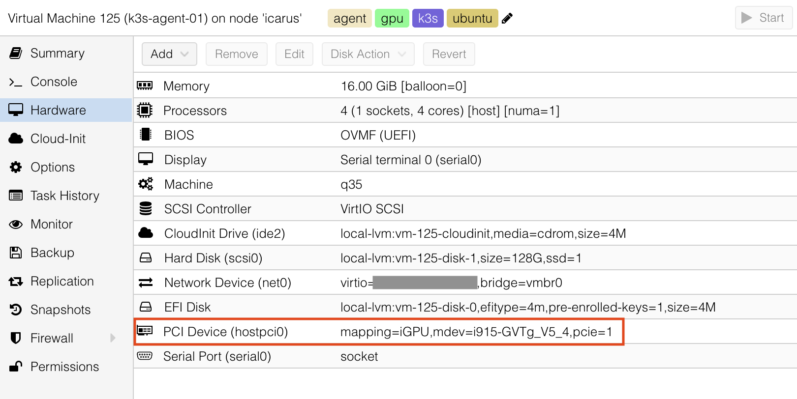
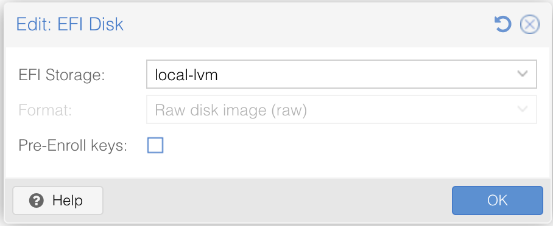

Time to add the GPU! For this your Kubernetes node VM needs to be powered off first. Hot-plugging isn't an option here. If you disabled the autostart option, it should still be powered off after the last host reboot.

## Step 1: Configure GPU Passthrough in Proxmox
Add the GPU via a mediated device (`MDev Type`) to your Kubernetes node VM using either a resource mapping or as a raw device:




**Important:** Ensure that `vIOMMU` in the Machine configuration is set to `Default (None)`.

## Step 2: Disable Secure Boot
Two ways to do this.

### Method 1: EFI Disk Replacement
Simply remove the current EFI disk and add a new one, ensuring `Pre-Enroll keys` is disabled:


### Method 2: BIOS Configuration
Alternatively, disable Secure Boot through the VM's BIOS:
1. Start the VM and quickly open the console
2. Press `Esc` repeatedly during boot to enter the BIOS
3. Navigate to `Device Manager → Secure Boot` and disable it (multiple confirmations required)
4. Save settings and reboot

## Step 3: Install GPU Drivers
Your approach depends on your OS.

### For Talos Systens
Add the official `i915` system extension to your installation. Extension management is beyond this guide's scope, but here's what you need:
```yaml
customization:
  systemExtensions:
    officialExtensions:
      - siderolabs/i915
```

### For Minimal or Cloud-Based Installations
SSH into your node and install the GPU drivers, reboot afterwards:
```bash
sudo apt install linux-generic -y
sudo reboot
```
### For Other Distributions
Most full distributions include these drivers by default. Verify that `linux-generic` is installed.

## Step 4: Verify GPU Passthrough
Let's confirm your GPU made it through.

### Verification on Talos
```bash
talosctl -n <node-name> ls /dev/dri		# Use your actual node name
```
Expected output:
```bash
NODE          NAME
<node-name>   .
<node-name>   by-path
<node-name>   card0						# Your GPU!
<node-name>   renderD128				# The render device
```

### Verification on Other Systems
Log into your node and execute:
```bash
ls /dev/dri
```
Should show:
```bash
by-path  card0  renderD128				# card0 is your GPU!
```

## Step 5: Configure Additional Nodes
Rinse and repeat! Apply these steps to every Kubernetes node that needs GPU support.
