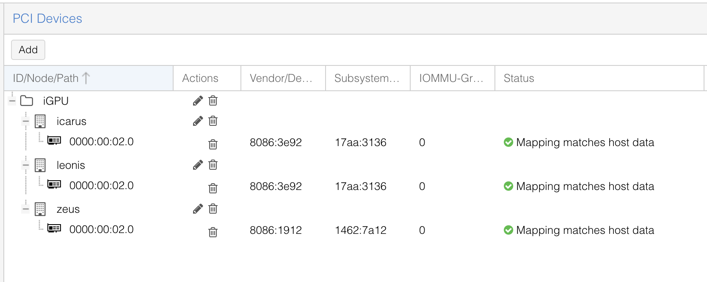

Access your Proxmox host via SSH or the web GUI's Shell option.

## Step 1: Enable IOMMU and Intel GVT-g
Edit the GRUB configuration file `/etc/default/grub` and update the `GRUB_CMDLINE_LINUX_DEFAULT` variable to:
```bash
GRUB_CMDLINE_LINUX_DEFAULT="intel_iommu=on iommu=pt i915.enable_gvt=1 pcie_acs_override=downstream,multifunction"
```
This is why you need this: `intel_iommu=on iommu=pt i915.enable_gvt=1` enables the core trio of IOMMU, passthrough, and GVT-g (mediated devices) functionality. The `pcie_acs_override=downstream,multifunction` parameter does the heavy lifting by forcing hardware into separate IOMMU groups. No more dealing with device clusters – you get individual control over each piece of hardware, plus the sweet benefit of a stable, non-crashing host.ß

Apply these new boot parameters by running:
```bash
sudo proxmox-boot-tool refresh
```

## Step 2: Load Required Kernel Modules
Those parameters won't work their magic without the right kernel modules loaded first. Add these to `/etc/modules`:
```bash
# Modules required for PCI passthrough
vfio
vfio_iommu_type1
vfio_pci
vfio_virqfd

# Modules required for Intel GVT-g Split
kvmgt
vfio_mdev
i915
```

## Step 3: Update Boot Image
Regenerate the boot image to include the new modules:
```bash
sudo update-initramfs -u -k all
```

## Step 4: Reboot

**WARNING**<br />Make sure you drain your Kubernetes nodes on the Proxmox host before rebooting!


Restart your Proxmox host for all changes to take effect:
```bash
sudo reboot
```
While rebooting, make sure you enabled all virtualization options in your BIOS like described [here](#bios-virtualization-settings).

## Step 5: Verify Configuration After Reboot
After reboot, verify the devices are properly separated into different IOMMU groups. Replace `<node>` with your actual PVE node name:
```bash
sudo pvesh get /nodes/<node>/hardware/pci --pci-class-blacklist ""
```

Your output should look similar to this:
```
┌──────────┬────────┬──────────────┬────────────┬────────┬──────────────────────────────────────
│ class    │ device │ id           │ iommugroup │ vendor │ device_name
╞══════════╪════════╪══════════════╪════════════╪════════╪══════════════════════════════════════
...
│ 0x020000 │ 0x154d │ 0000:01:00.0 │         10 │ 0x8086 │ Ethernet 10G 2P X520 Adapter
├──────────┼────────┼──────────────┼────────────┼────────┼──────────────────────────────────────
│ 0x020000 │ 0x154d │ 0000:01:00.1 │         11 │ 0x8086 │ Ethernet 10G 2P X520 Adapter
├──────────┼────────┼──────────────┼────────────┼────────┼──────────────────────────────────────
│ 0x030000 │ 0x3e92 │ 0000:00:02.0 │          0 │ 0x8086 │ CoffeeLake-S GT2 [UHD Graphics 630]
├──────────┼────────┼──────────────┼────────────┼────────┼──────────────────────────────────────
│ 0x040380 │ 0xa348 │ 0000:00:1f.3 │          9 │ 0x8086 │ Cannon Lake PCH cAVS
...
```
Take note of the GPU ID (which is `0000:02:00.0` in this example), as you'll use it in the next step.

## Step 6: Confirm GVT-g Support
Verify that GVT-g split is working and mediated devices are available. Replace `<gpu id>` with your GPU's ID from the previous step:
 ```bash
 sudo ls /sys/bus/pci/devices/<gpu id>/mdev_supported_types
```

You should see the following output:
```
i915-GVTg_V5_4  i915-GVTg_V5_8
```

## Step 7: Configure Additional Hosts
If you have multiple Proxmox VE hosts with GPUs, repeat these steps on each host.


**TIP**<br />If you have a Proxmox VE cluster, you can create a resource mapping (`Datacenter → Resource Mappings`). This mapping can then be added to your VM hardware instead of a directly connected raw device.


